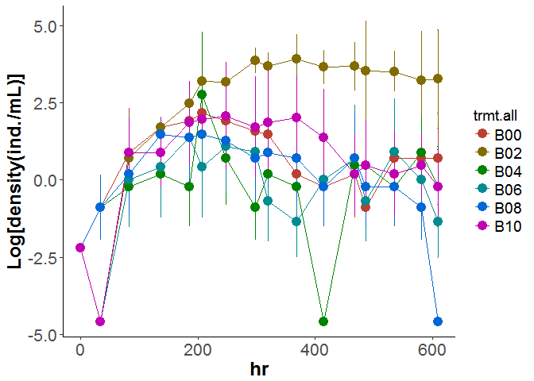
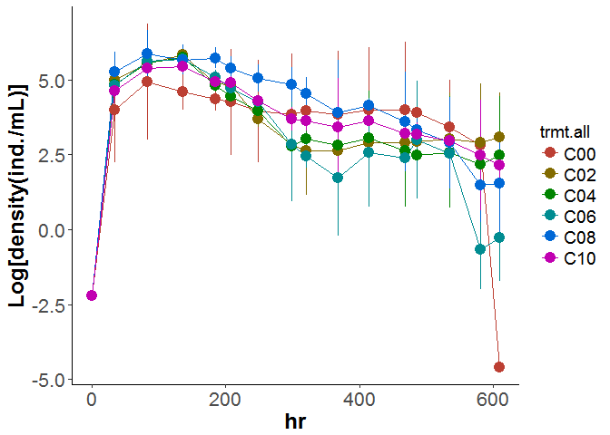
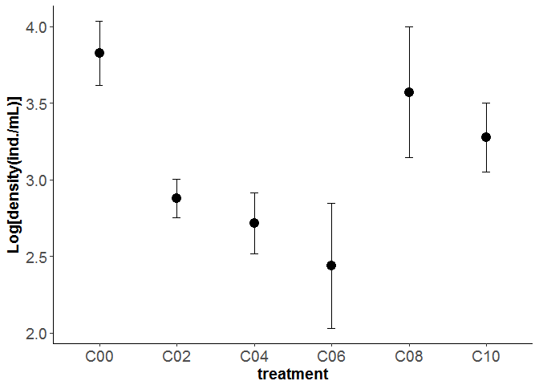
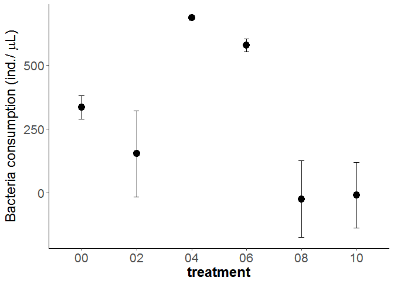
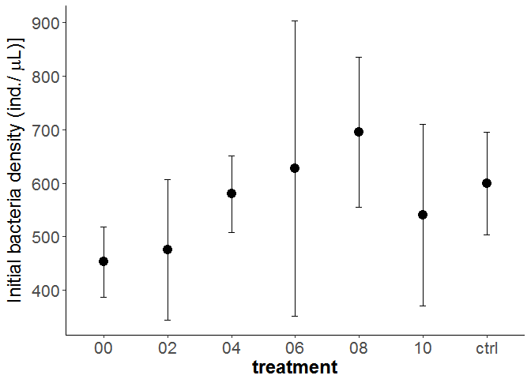

# In Lab experiment
Oscar Feng-Hsun Chang  
2017 May  
        


Based on the classic paper by Holling in 1959, predator-prey interaction can be modeled by the following functions (i.e. so called Type I or Type II functional response). Both functional responses contains a parameter that describes the proportion of prey that is available for the predator.  

1. Type I functional response:  

$$f(R) = {\alpha}TR $$, where ${\alpha}$ is the encounter probability, $T$ is the searching time, and $R$ is the prey density. Encounter probability (${\alpha}$) is the proportion of prey that is available for the predator.  

2. Type II functional response:  

$$f(R) = \frac{{\alpha}TR}{1+{\alpha}hR}$$, where ${\alpha}$ is again the encounter probability, $T$ is the searching time, and $h$ is the handling time. 

In my lab experiment, I directly modified the ${\alpha}$ parameter because I used the screen mesh to modify the proportion of IG prey that is available to the IG predator. This lab experiment would thus be valid to verify my model predictions. 

# Population dynamics visualization

First visualize the population dynamics of the two protozoa species.  

*Blepharisma*

<!-- -->

*Colpidium*

<!-- -->

Now I take the hour 368, 414, 468, 486, and 535 to calculate the mean and standard error of two protozoa density in the six treatments (0%, 20%, 40%, 60%, 80%, and 100% encounter probability). 

# Model predictions

From the model I derive three major predictions. 

## 1. IG prey 

### Model prediction

Here I extract the IG prey density at the equilibrium from the model. According to the model that used type I functinoal response to model intra-guild predation, I would expect the IG prey density to monotonically decrease with encounter probability. 


### Experimental results 

Here I calculate the mean IG prey (*Colpidium*) density across the six treatments (0%, 20%, 40%, 60%, 80% and 100% encounter probability)

<!-- -->

The two plots does not match. This mismatch suggests to me that the type I functional response in the model is not proper to describe the population dynamics of IG prey and IG predator. 

## 2. IG predator

### Model prediction

Here I extract the IG predator density at the equilibrium from the model. According to the model that used type I functinoal response to model intra-guild predation, I would expect the IG predator density to monotonically increase with encounter probability. 


### Experimental results 

Here I calculate the mean IG predator (*Blepharisma*) density across the six treatments (0%, 20%, 40%, 60%, 80% and 100% encounter probability).

<!-- -->

The two plots not match agian. This further suggests that type I functional response in my current model should be modified.

## 3. Bacteria consumption

### Model prediction

Here I extract the total consumer density at the equilibrium from the model. Because both IG prey and IG predator consume bacteria with type I functional response, total consumer density is proportional to bacteria consumption. According to the model, I would expect the bacteria consumption to first increase and then decrease with encounter probability. 


### Experimental results 


<!-- -->

This experimental results match the model prediction. This means that when intermediate proportion of IG prey is accessiable to the IG predator, overall consumption of shared resources would be higher. In addition, we see that when encounter probability is high (i.e. 80% and 100%), bacteria consumption is the lowest. This suggest that in high encounter probability treatments, IG predator is satiated by the IG prey so that shared resources are partly released from the consumption by the IG predator and can accumulate their density. Higher shared resource density in these treatments is the reason why IG prey can have higher density in these treatments.  

From these experimental results, I suspect that in this system, intra-guild predation should be modeled by type II functinoal response along with prey switching behavior. 

# Additional checkes

## 1. Check initial bacteria density.  

First I check if the initial bacteria density across treatments are the same. 


```r
Bac_pop_stat %>%
  ddply(c("gp"), summarize,
    rep_trmt = length(T0),
    avg_trmt = mean(T0),
    sd_trmt = sd(T0),
    se_trmt = sd_trmt/sqrt(rep_trmt)
    ) %>%
  ggplot(aes(x=gp, y=avg_trmt)) +
    geom_errorbar(aes(ymin=avg_trmt-qnorm(0.975)*se_trmt, ymax=avg_trmt+qnorm(0.975)*se_trmt), width=.1) + 
    geom_point(size=4) + 
    xlab("treatment") + 
    ylab(expression(paste("Initial bacteria density (ind./", mu, "L)]"))) + 
    theme_bw() +
    theme(panel.border = element_blank(), panel.grid.major = element_blank(), 
          panel.grid.minor = element_blank(), axis.line = element_line(colour = "black"), 
          axis.text=element_text(size=16), axis.title=element_text(size=18,face="bold"),
          legend.key=element_rect(color="white", fill="white"), 
          legend.title=element_text(size=14),
          legend.text=element_text(size=14)
    ) 
```

<!-- -->

```r
mod_Bac_T0 =  kruskal.test(T0~as.factor(gp), data=Bac_pop_stat)
mod_Bac_T0
```

```
## 
## 	Kruskal-Wallis rank sum test
## 
## data:  T0 by as.factor(gp)
## Kruskal-Wallis chi-squared = 8.8608, df = 6, p-value = 0.1816
```

```r
dunn.test(Bac_pop_stat[,"T0"], 
          Bac_pop_stat[,"gp"], method="bh")
```

```
##   Kruskal-Wallis rank sum test
## 
## data: x and group
## Kruskal-Wallis chi-squared = 8.8608, df = 6, p-value = 0.18
## 
## 
##                            Comparison of x by group                            
##                              (Benjamini-Hochberg)                              
## Col Mean-|
## Row Mean |         00         02         04         06         08         10
## ---------+------------------------------------------------------------------
##       02 |  -0.285798
##          |     0.4069
##          |
##       04 |  -1.460746  -1.174948
##          |     0.2521     0.2800
##          |
##       06 |  -1.901142  -1.631688  -0.523936
##          |     0.2005     0.2697     0.3940
##          |
##       08 |  -2.381652  -2.095854  -0.920905  -0.344301
##          |     0.1810     0.1895     0.3125     0.4038
##          |
##       10 |  -1.016171  -0.730373   0.444575   0.943086   1.365480
##          |     0.3250     0.3489     0.4056     0.3299     0.2582
##          |
##     ctrl |  -1.556013  -1.270214  -0.095266   0.434119   0.825639  -0.539841
##          |     0.2514     0.2678     0.4621     0.3875     0.3304     0.4125
```

The initial bacteria density are not significantly different from each other.  


```r
mod_B =  kruskal.test(avg~as.factor(trmt.all), data=B_stat)
mod_B
dunn.test(B_stat[,"avg"], 
          B_stat[,"trmt.all"], method="bh")
```


```r
mod_bac = kruskal.test(dif~as.factor(gp), data=Bac_pop_stat)
mod_bac

summary(mod_bac)
dunn.test(Bac_pop_stat[,"dif"], 
          Bac_pop_stat[,"gp"], method="bh")
```


```r
Bac_pop_stat[,"gp"] = relevel(as.factor(Bac_pop_stat[,"gp"]), ref="ctrl")
mod_bac1 = lmer(dif~as.factor(gp)+(1|rep), data=Bac_pop_stat, REML=FALSE)
coefs = data.frame(coef(summary(mod_bac1)))
# use normal distribution to approximate p-value
coefs[,"p.z"] = 2 * (1 - pnorm(abs(coefs$t.value)))
coefs
```


