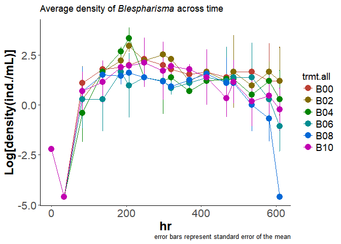
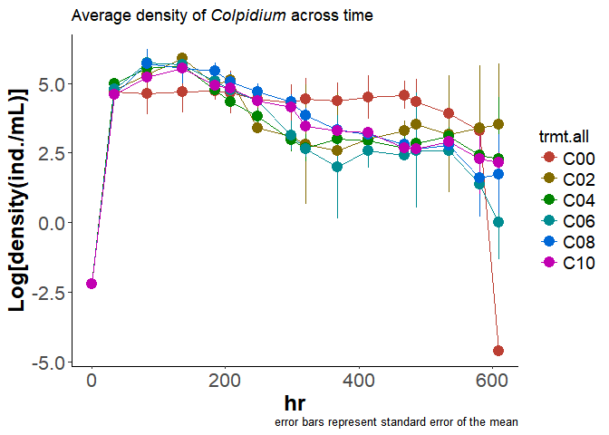
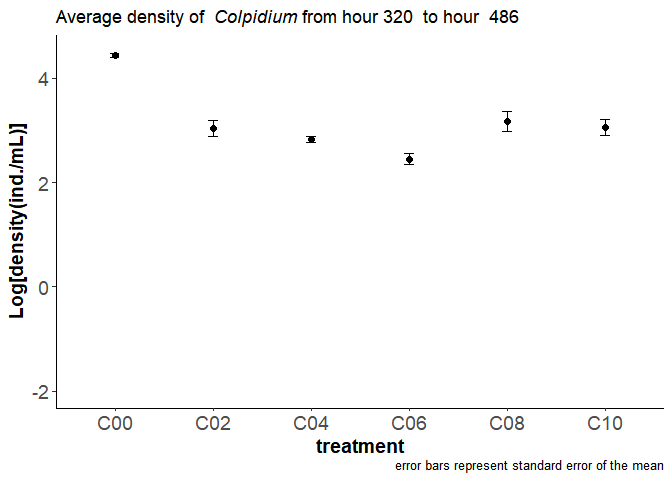
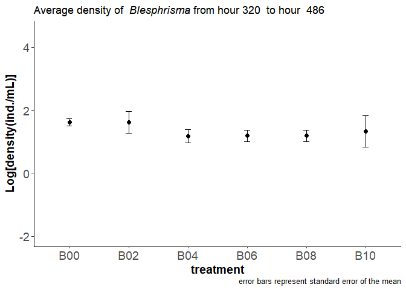
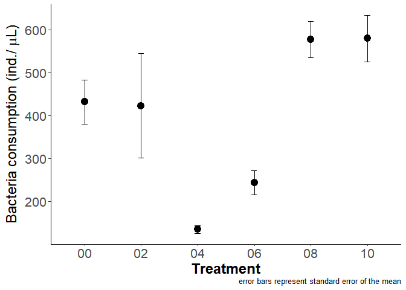

# In Lab experiment
Oscar Feng-Hsun Chang  
2017 Sep. 27  
        


Based on the classic paper by Holling in 1959, predator-prey interaction can be modeled by the following functions (i.e. so called Type I or Type II functional response). Both functional responses contains a parameter that describes the proportion of prey that is available for the predator. 

1. Type I functional response:  

$$f(R) = {\alpha}TR $$, where ${\alpha}$ is the encounter probability, $T$ is the searching time, and $R$ is the prey density. Encounter probability (${\alpha}$) is the proportion of prey that is available for the predator.  

2. Type II functional response:  

$$f(R) = \frac{{\alpha}TR}{1+{\alpha}hR}$$, where ${\alpha}$ is again the encounter probability, $T$ is the searching time, and $h$ is the handling time. 

In my lab experiment, I directly modified the ${\alpha}$ parameter because I used the screen mesh to modify the proportion of IG prey that is available to the IG predator. This lab experiment would thus be valid to verify my model predictions. 

# Population dynamics visualization

First visualize the population dynamics of the two protozoa species.  

*Blepharisma*

<!-- -->

*Colpidium*

<!-- -->

For both *Blespharisma* and *Colpidium*, I calculated the mean density for all six treatments (0%, 20%, 40%, 60%, 80% and 100% encounter probability) at the steady state. Because I cannot be 100% sure what are the most representative time points for the steady state, I calculate the mean density of every five consecutive time points. I then moved this five-point time frame gradually forward from hour 34 to hour 535. Finally , I chose the time frame of  hour 320 to 486 since the other time frames are qualitatively the same.

# Experimental results

## 1. IG prey density at the steady state


<!-- -->

## Statistical check


```
## 
## 	Kruskal-Wallis rank sum test
## 
## data:  avg by as.factor(trmt.all)
## Kruskal-Wallis chi-squared = 19.688, df = 5, p-value = 0.00143
```

```
##   Kruskal-Wallis rank sum test
## 
## data: x and group
## Kruskal-Wallis chi-squared = 19.6877, df = 5, p-value = 0
## 
## 
##                            Comparison of x by group                            
##                              (Benjamini-Hochberg)                              
## Col Mean-|
## Row Mean |        C00        C02        C04        C06        C08
## ---------+-------------------------------------------------------
##      C02 |   2.247567
##          |     0.0461
##          |
##      C04 |   2.643139   0.395571
##          |     0.0308     0.4328
##          |
##      C06 |   4.387252   2.139684   1.744112
##          |    0.0001*     0.0347     0.0676
##          |
##      C08 |   2.013820  -0.233747  -0.629318  -2.373431
##          |     0.0413     0.4703     0.3969     0.0441
##          |
##      C10 |   2.193626  -0.053941  -0.449513  -2.193626   0.179805
##          |     0.0353     0.4785     0.4453     0.0424     0.4593
```

For the *Colpidium*, We see that 0% encounter probability treatment, which is the treatment where two protozoa species engage in only competition, has significantly higher density than the other trThis suggests that *Colpidium* density would be lower as long as intra-guild predation occurs. 

## 2. IG predator density at the steady state


<!-- -->

## Statistical check


```
## 
## 	Kruskal-Wallis rank sum test
## 
## data:  avg by as.factor(trmt.all)
## Kruskal-Wallis chi-squared = 9.1165, df = 5, p-value = 0.1045
```

```
##   Kruskal-Wallis rank sum test
## 
## data: x and group
## Kruskal-Wallis chi-squared = 9.1145, df = 5, p-value = 0.1
## 
## 
##                            Comparison of x by group                            
##                              (Benjamini-Hochberg)                              
## Col Mean-|
## Row Mean |        B00        B02        B04        B06        B08
## ---------+-------------------------------------------------------
##      B02 |   0.559584
##          |     0.3599
##          |
##      B04 |   2.021724   1.462140
##          |     0.1080     0.1796
##          |
##      B06 |   2.166133   1.606549   0.144408
##          |     0.1136     0.1622     0.4426
##          |
##      B08 |   2.328593   1.769009   0.306868   0.162460
##          |     0.1491     0.1442     0.4379     0.4666
##          |
##      B10 |   1.155271   0.595686  -0.866453  -1.010862  -1.173322
##          |     0.2325     0.3759     0.2897     0.2601     0.2579
```

Density of IG predator at the steady state are not significanly different from each other. 

## 3. Bacteria consumption

Now I check the bacteria consumption in different treatments. To calculate bacteria consumption, I first calculate the bacteria density change in each treatment, including the control treatment where two protozoa species are not present. I then compare the bacteria density change in each treatment (i.e. 0%, 20%, 40%, 60%, 80%, 100% encounter probability) to the control treatment to calculate the bacteria consumption in each treatment. 

### Model prediction

According to the mathematical model, I hypothesize that bacteria consumption would first increase and than decrease with intra-guild predation rate (see below). Again, I used the encounter probability between the two protozoa species to represent the intra-guild predation rate. 


### Experimental results 


<!-- -->

### Statistical check


```
## 
## 	Kruskal-Wallis rank sum test
## 
## data:  dif by as.factor(trmt_all)
## Kruskal-Wallis chi-squared = 11.216, df = 5, p-value = 0.04727
```

```
##   Kruskal-Wallis rank sum test
## 
## data: x and group
## Kruskal-Wallis chi-squared = 11.2156, df = 5, p-value = 0.05
## 
## 
##                            Comparison of x by group                            
##                              (Benjamini-Hochberg)                              
## Col Mean-|
## Row Mean |         00         02         04         06         08
## ---------+-------------------------------------------------------
##       02 |   0.723746
##          |     0.3199
##          |
##       04 |   2.302830   1.579084
##          |     0.0798     0.1225
##          |
##       06 |   2.697601   1.973855   0.394771
##          |     0.0524     0.0907     0.3998
##          |
##       08 |   1.160576   0.386858  -1.301252  -1.723280
##          |     0.2048     0.3744     0.1811     0.1060
##          |
##       10 |   0.750324  -0.058848  -1.824318  -2.265686  -0.504524
##          |     0.3398     0.4765     0.1022     0.0587     0.3837
```

Because all five measurements are not independent, I used mixed model to take into account the potential correlation structure withing each treatment (i.e. the repeat is the random effect).


```
##                         Estimate Std..Error    t.value          p.z
## (Intercept)            -69.20610   84.78854 -0.8162199 0.4143743791
## as.factor(trmt_all)02  -45.14460  119.90911 -0.3764902 0.7065525284
## as.factor(trmt_all)04 -338.42637  119.90911 -2.8223575 0.0047672006
## as.factor(trmt_all)06 -450.24172  119.90911 -3.7548583 0.0001734395
## as.factor(trmt_all)08 -114.01696  112.16470 -1.0165137 0.3093848235
## as.factor(trmt_all)10  -73.14483  107.24997 -0.6820033 0.4952368601
```

This mixed effects model reveals that bacteria consumption in 40% and 60%encounter probability treatments would be significantly higher than that in the other treatments. 
# Explanations

The experimental settings are a semi-chemostat, where 2.5% (5 out of 200 ml) of the media was being replaced with fresh media every 48 hours. This induced a fixed *per capita* loss rate for both IG prey and IG predator. This loss rate of IG predator (*Blepharisma*) will be equilibrated by the consumption of either the IG prey or bacteria. 

When the contact probability between IG prey and IG predator increase from 0% to 60%, IG prey density at the steady state gradually decreases, which suggests that IG prey is subject to higher loss from predation. Two things occurs during this phase of increasing IGP. First, IG prey should have gradually higher growth rate in order to meet the loss from predation, so IG prey should consume more bacteria. Second, IG predator should consume gradually less bacteria. Because the IG prey is the more efficient grazer of bacteria (Morin 1999), the overall consumption of bacteria would increase with the increase of IGP. 

When the contact probability between IG prey and IG predator further increases from 60% to 100%, IG predator is satiated, so that IG prey density at the steady state does not decrease further. During this phase, even less bacteria is being consumed by the IG predator. In addition, because IG prey does not loss more due to predation, bacteria consumption of IG prey does not increase further. The overall bacteria consumption therefore decreases in this phase. 


