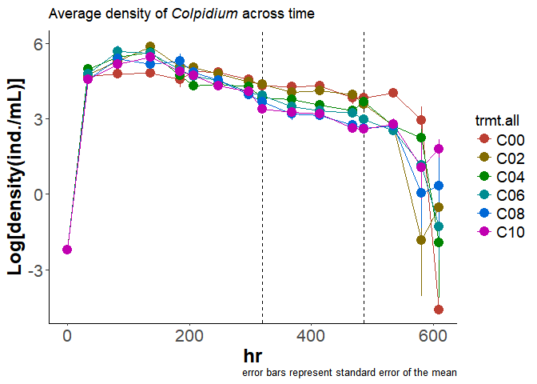

# In Lab experiment
Oscar Feng-Hsun Chang  
2017 Nov. 2  
        


# Hypothesis


```r
dat.mod_I = read.table(file="D:/Research/IGP_LabExp/Analysis/Type2ModResults/Type1.csv", sep=",", header=TRUE, fill=TRUE)
dat.mod_I = dat.mod_I %>%
  mutate(Res = (R1+R2)/(dat.mod_I[1,"R1"]+dat.mod_I[1,"R2"]),
         Cons = C/(dat.mod_I[1,"C"]),
         Pred = P/(dat.mod_I[1,"P"]))
dat.mod_I %>%
  ggplot() +
  geom_line(data=dat.mod_I, aes(x=alpha, y=Res), linetype=1) +
  labs(x=expression(paste("Contact probability (", alpha, ")")),
       y=expression(paste("% chang to ", alpha, "= 0"))) + 
  theme_bw() +
  theme(panel.border = element_blank(), panel.grid.major = element_blank(), 
        panel.grid.minor = element_blank(), axis.line = element_line(colour = "black"), 
        axis.text=element_text(size=14), axis.title=element_text(size=14,face="bold"),
        legend.key=element_rect(color="white", fill="white"), 
        legend.title=element_text(size=14),
        legend.text=element_text(size=14),
        plot.caption=element_text(size=8, hjust=1, margin=margin(t=12))) 
```

<!-- -->

# Experimental Results

## Population dynamics visualization

First I used the population density of IG predator and IG prey to identify if the system reached steady state. 

IG predator *Blepharisma*


<!-- -->

IG prey *Colpidium*


<!-- -->

For both *Blespharisma* and *Colpidium*, I calculated the mean density for all six treatments (0%, 20%, 40%, 60%, 80% and 100% encounter probability) at the steady state. Because I cannot be 100% sure what are the most representative time points for the steady state, I calculate the mean density of every five consecutive time points. I then moved this five-point time frame gradually forward from hour 34 to hour 535. Finally , I chose the time frame of  hour 320 to 486 since the other time frames are qualitatively the same.

## Resource (bacteria) density at steady state


<!-- -->

# Explanations

From the literature and another independent experiment, I found that both IG predator and IG prey have type II functional response when consuming bacteria and IG prey. I therefore estimate the attack rate and handling time of the IG predator and extract the attack rate and handling time of IG prey from literatur to build another more mechanistic model. 

<!-- -->

```
## 
## Formula: Cons ~ s2 * Init/(1 + (h2 * s2 * Init))
## 
## Parameters:
##    Estimate Std. Error t value Pr(>|t|)    
## s2  0.38074    0.05945   6.404 1.55e-06 ***
## h2  0.56826    0.03125  18.181 3.82e-15 ***
## ---
## Signif. codes:  0 '***' 0.001 '**' 0.01 '*' 0.05 '.' 0.1 ' ' 1
## 
## Residual standard error: 0.1388 on 23 degrees of freedom
## 
## Number of iterations to convergence: 6 
## Achieved convergence tolerance: 3.095e-06
```

The updated model contains typeII functional response for all feeding links (both IG predator and IG prey on bacteria or IG predator on IG prey). 

Now I confront the density of IG predator,  IG prey, and bacteria with the model predictions. In the following figures, solid dot with error bar (standard error) represent results from the experiment, and the dotted line represents model predictions. In addition, in order to compare the experimenal results with the model predictions, I scaled density on the condition where IGP is not allowed to occur (${\alpha}$=0). 

## IG predator (*Blepharisma*)

<!-- -->

## IG prey (*Colpidium*)

<!-- -->

## Bacteria (resource) density 


```
## Warning: Removed 7 rows containing missing values (geom_path).
```

<!-- -->


