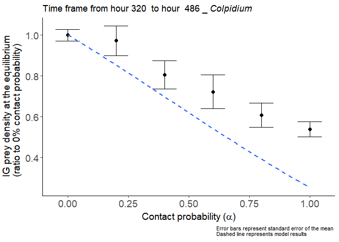
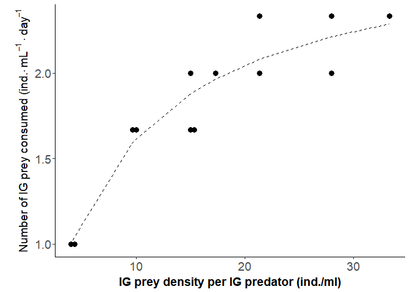

# In Lab experiment
Oscar Feng-Hsun Chang  
2017 Nov. 15  
        

# Hypothesis

From the model with just type I functional response, I hypothesized that the resource density at the equilibrium should first decease and then increase with the contact probability ($\alpha$; the proportion of IG prey that is available to the IG predator). Note that I re-scaled the resource density at the equilibrium on the condition where contact probability ($\alpha$=0), so that it is comparable across model and experimental results. 

<!-- -->

To test this hypothesis, I designed an experiment that manipulates the contact probability by installing a screen mesh that is permeable to IG prey but not IG predator. With the screen mesh, I manipulated the proportion of IG prey that is available to IG predator. 

# Experimental Results

## Population dynamics visualization

First I used the population density of IG predator and IG prey to identify if the system reached the steady state. 

IG predator *Blepharisma*

<!-- -->

IG prey *Colpidium*

<!-- -->

For both *Blespharisma* and *Colpidium*, I calculated the mean density for all six treatments (0%, 20%, 40%, 60%, 80% and 100% encounter probability) at the steady state. Because I cannot be 100% sure what are the most representative time points for the steady state, I calculate the mean density of every five consecutive time points. I then moved this five-point time frame gradually forward from hour 34 to hour 535. Finally , I chose the time frame of  hour 320 to 486 since the other time frames are qualitatively the same.

# Confronting model with empirical data

Now I overlay the model predictions onto the IG predator, IG prey, and resource density at the equilibrium measured in empirical experiment. 

## IG predator (*Blepharisma*)

<!-- -->

For the IG predator, the model with type I functional response explains 0% ($R^2$ is -32.6339) of the empirical data. 
## IG prey (*Colpidium*)

<!-- -->

For the IG prey, the model with type I functional response explains 11.81% of the empirical data.

## Bacteria (resource) density

<!-- -->

For the resources (bacteria), the model with type I functional response explains 0% ($R^2$ is -0.5809) of the empirical data.

The empirical data only qualitatively confirm the IG prey and resource density at the equilibrium and the R^2 is fairly low. The IG predator density at the equilibrium can not be described by the model with just type I functional  response. 

From the literature[@Laybourn1975; @Fenchel1980], I found that both IG predator and IG prey have type II functional response when consuming bacteria. However, attack rate and handling time of IG predator are not specifically estimated. I therefore extracted the attack rate and handling time from [@Laybourn1975] for IG prey and used similar value for IG predator to build another more mechanistic model. 

In addition, I did another independent experiment to estimate the attack rate and handling time for IG predator when consuming IG prey. 

<!-- -->

The attack rate and the handing time for IG predator when consuming IG prey are estimated to be 0.3858 and 0.3596 respectively. This means the maximum consumption per day should be 2.7809 (IG prey/IG predator) and the half saturation density of IG prey is 7.2081. 

# Confronting the updated model with empirical data

Now I overlay the predictions from updated model onto the IG predator, IG prey, and resource density at the equilibrium measured in empirical experiment. 

## IG predator (*Blepharisma*)

<!-- -->

For the IG predator, the model with type II functional response explains 72.76% of the empirical data. 

## IG prey (*Colpidium*)

<!-- -->

For the IG prey, the model with type II functional response explains 87.57% of the empirical data.

## Bacteria (resource) density

<!-- -->

For the resources (bacteria), the model with type II functional response explains 87.35% of the empirical data.

# Explanation

When contact probability is low ($\alpha$= 20%), only small proportion of IG prey is being consumed by IG predator. The main interaction between IG prey and IG predator is still competition, so bacteria consumption is not different from the treatment where IGP is not allowed to occur ($\alpha$= 0%). When contact probability gradually increases to 40-60%, the IG predator reached higher density but the IG prey is not being completely suppressed as the IG predator has not yet satiated by IG prey (the IG prey to IG predator ratio is 15.0826 to 19.0456). With high IG predator density and intermediate IG prey density, bacteria density is being suppressed to lowest degree. When contact probability increase further higher to over 80%, IG predator is satiated by the IG prey (the IG prey to IG predator ratio is over 22.5106). The IG prey density therefore does not decrease further. The reduction of IG predator could be due to competition incurred by the IG prey. The lowest level of IG prey density and satiated IG predator result in highest resource density at the equilibrium. 

