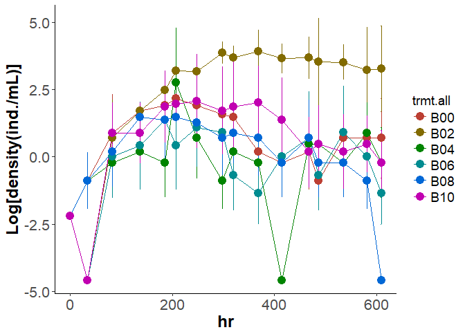
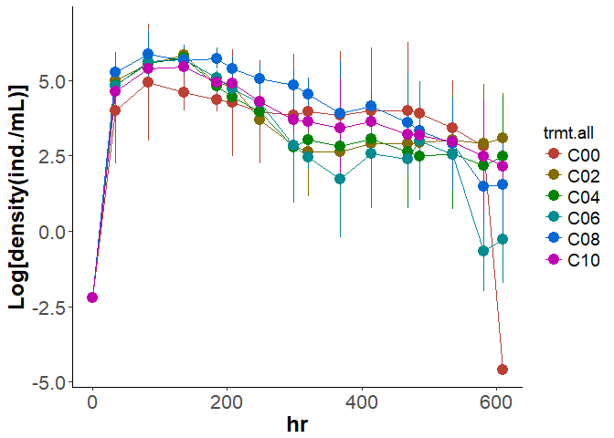
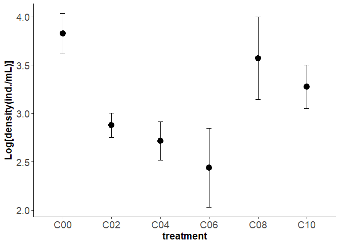
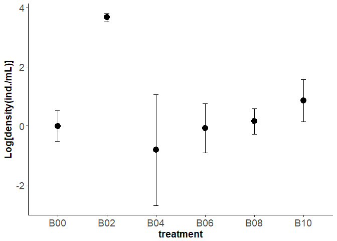
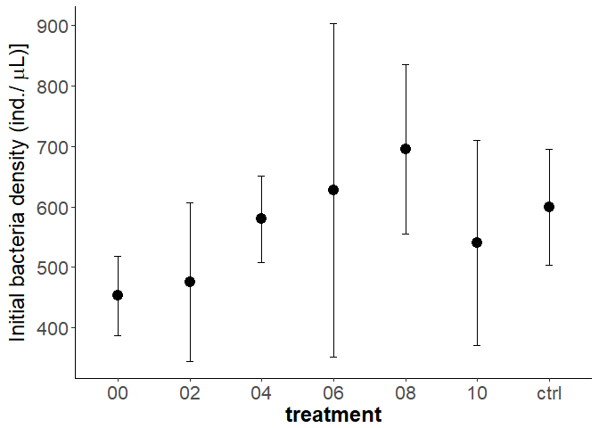
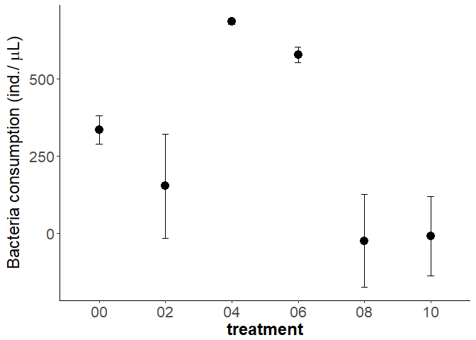

# In Lab experiment
Oscar Feng-Hsun Chang  
2017 May  
        


<<<<<<< HEAD

=======
>>>>>>> origin/master

Based on the classic paper by Holling in 1959, predator-prey interaction can be modeled by the following functions (i.e. so called Type I or Type II functional response). Both functional responses contains a parameter that describes the proportion of prey that is available for the predator. 
1. Type I functional response:  

$$f(R) = {\alpha}TR $$, where ${\alpha}$ is the encounter probability, $T$ is the searching time, and $R$ is the prey density. Encounter probability (${\alpha}$) is the proportion of prey that is available for the predator.  

2. Type II functional response:  

$$f(R) = \frac{{\alpha}TR}{1+{\alpha}hR}$$, where ${\alpha}$ is again the encounter probability, $T$ is the searching time, and $h$ is the handling time. 

In my lab experiment, I directly modified the ${\alpha}$ parameter because I used the screen mesh to modify the proportion of IG prey that is available to the IG predator. This lab experiment would thus be valid to verify my model predictions. 

# Population dynamics visualization

First visualize the population dynamics of the two protozoa species.  

*Blepharisma*

<!-- -->

*Colpidium*

<!-- -->

<<<<<<< HEAD
Now I take the hour 368, 414, 468, 486, and 535 to calculate the mean and standard error of two protozoa density in the six treatments (0%, 20%, 40%, 60%, 80%, and 100% encounter probability). 

# Model predictions

From the model I derive three major predictions. 

## 1. IG prey 

### Model prediction

Here I extract the IG prey density at the equilibrium from the model. According to the model that used type I functinoal response to model intra-guild predation, I would expect the IG prey density to monotonically decrease with encounter probability. 


### Experimental results 

Here I calculate the mean IG prey (*Colpidium*) density across the six treatments (0%, 20%, 40%, 60%, 80% and 100% encounter probability)

However, for the IG prey, I would expect its density to decrease with the increase of intra-guild predation rate, which, in theory, should be proportional to the encounter probability between IG prey and IG predator.

<!-- -->


# Treatment check

In terms of IG predator density, I would expect it to be similar across treatments. From the pilot experiment (see below), I've observed that the density of IG predator (*Blepharisma*) is not affected by the occurrence of intra-guild predation. 


## Mean *Blepharisma* density across treatments. 

<!-- -->

From this plot, the only treatment that would be significantly higher than the other treatments are the 20% treatment. 

### Statistical check

=======
Now I take the final 5 data points (hour 414, 468, 486, 535, 581) to calculate the mean and standard error of two protozoa density in the six treatments (0%, 20%, 40%, 60%, 80%, and 100% enounter probability). 

In terms of IG predator density, I would expect it to be similar across treatments. From the pilot experiment, the density of IG predator (*Blepharisma*) is not affected by the occurance of intra-guild predation. 


*Blepharisma* density across treatments. 

<!-- -->

>>>>>>> origin/master

```
## 
## 	Kruskal-Wallis rank sum test
## 
## data:  avg by as.factor(trmt.all)
<<<<<<< HEAD
## Kruskal-Wallis chi-squared = 15.083, df = 5, p-value = 0.01001
=======
## Kruskal-Wallis chi-squared = 14.371, df = 5, p-value = 0.01342
>>>>>>> origin/master
```

```
##   Kruskal-Wallis rank sum test
## 
## data: x and group
<<<<<<< HEAD
## Kruskal-Wallis chi-squared = 15.4702, df = 5, p-value = 0.01
=======
## Kruskal-Wallis chi-squared = 15.3381, df = 5, p-value = 0.01
>>>>>>> origin/master
## 
## 
##                            Comparison of x by group                            
##                              (Benjamini-Hochberg)                              
## Col Mean-|
## Row Mean |        B00        B02        B04        B06        B08
## ---------+-------------------------------------------------------
<<<<<<< HEAD
##      B02 |  -2.928891
##          |    0.0085*
##          |
##      B04 |   0.289273   3.218164
##          |     0.4456    0.0097*
##          |
##      B06 |  -0.415830   2.513061  -0.705103
##          |     0.4235    0.0224*     0.3606
##          |
##      B08 |   0.271193   3.200084  -0.018079   0.687023
##          |     0.4212    0.0052*     0.4928     0.3355
##          |
##      B10 |  -1.229411   1.699480  -1.518684  -0.813580  -1.500604
##          |     0.2052     0.1338     0.1611     0.3466     0.1430
```

The density of 20% encounter probability treatment has significantly higher density than the other treatments (the p-value of Kruskal-Wallis test is 0.0100129) and the pair-wise comparison (Dunn's test) also show significant difference between 20% treatment versus other treatments. 

## Mean *Colpidium* density across treatments.

However, for the IG prey, I would expect its density to decrease with the increase of intra-guild predation rate, which, in theory, should be proportional to the encounter probability between IG prey and IG predator.

<!-- -->

From the plot, all treatments has lower density comparing to the 0% treatment, which is the treatment where two protozoa species engage in only competition. This suggests that *Colpidium* density would be lower as long as intra-guild predation occurs. 

### Statistical check
=======
##      B02 |  -2.725718
##          |    0.0241*
##          |
##      B04 |  -0.126357   2.599360
##          |     0.4497    0.0233*
##          |
##      B06 |  -0.252715   2.473002  -0.126357
##          |     0.4618     0.0251     0.4818
##          |
##      B08 |   0.992811   3.718529   1.119169   1.245526
##          |     0.2673    0.0015*     0.2466     0.2281
##          |
##      B10 |  -0.703993   2.021724  -0.577635  -0.451277  -1.696804
##          |     0.3611     0.0648     0.3842     0.4074     0.1122
```

The density of 20% encounter probability treatment has significantly higher density than the other treatments (the p-value of Kruskal-Wallis test is 0.013417) and the pair-wise comparison (Dunn't test) also show significant difference between 20% treatment versus other treatments. 

However, for the IG prey, I would expect its density to decrease with the increase of intra-guild predation rate, which, in theory, should be proportional to the encounter probabilty between IG prey and IG predator.

*Colpidium*

<!-- -->
>>>>>>> origin/master


```
## 
## 	Kruskal-Wallis rank sum test
## 
## data:  avg by as.factor(trmt.all)
<<<<<<< HEAD
## Kruskal-Wallis chi-squared = 21.447, df = 5, p-value = 0.0006668
=======
## Kruskal-Wallis chi-squared = 12.476, df = 5, p-value = 0.02882
>>>>>>> origin/master
```

```
##   Kruskal-Wallis rank sum test
## 
## data: x and group
<<<<<<< HEAD
## Kruskal-Wallis chi-squared = 21.4466, df = 5, p-value = 0
=======
## Kruskal-Wallis chi-squared = 12.476, df = 5, p-value = 0.03
>>>>>>> origin/master
## 
## 
##                            Comparison of x by group                            
##                              (Benjamini-Hochberg)                              
## Col Mean-|
## Row Mean |        C00        C02        C04        C06        C08
## ---------+-------------------------------------------------------
<<<<<<< HEAD
##      C02 |   2.551246
##          |    0.0201*
##          |
##      C04 |   3.144142   0.592895
##          |    0.0062*     0.3192
##          |
##      C06 |   3.701104   1.149857   0.556962
##          |    0.0016*     0.1706     0.3094
##          |
##      C08 |   0.700694  -1.850552  -2.443447  -3.000409
##          |     0.3022     0.0602    0.0182*    0.0067*
##          |
##      C10 |   1.221723  -1.329522  -1.922418  -2.479380   0.521029
##          |     0.1664     0.1531     0.0584    0.0197*     0.3012
```

For the *Colpidium*, We see that 0% encounter probability treatment tend to have higher density than the other treatments, although the multiple comparison results show that 40% and 60% encounter probability treatment are the only two treatments that has significantly lower density. 

# Testing hypothesis

According to the mathematical model, I hypothesize that bacteria consumption would first increase and than decrease with intra-guild predation rate (see below). Again, I used the encounter probability between the two protozoa species to represent the intra-guild predation rate. 


## Check initial bacteria density.  

First I check if the initial bacteria density across treatments are the same. 
=======
##      C02 |   1.473747
##          |     0.1318
##          |
##      C04 |   2.426291   0.952544
##          |     0.0572     0.2840
##          |
##      C06 |   2.983439   1.509692   0.557148
##          |    0.0214*     0.1639     0.3331
##          |
##      C08 |   0.682956  -0.790791  -1.743335  -2.300483
##          |     0.3091     0.2925     0.1219     0.0536
##          |
##      C10 |   0.952544  -0.521203  -1.473747  -2.030895   0.269587
##          |     0.2556     0.3226     0.1506     0.0792     0.3937
```

For the *Colpidium*, We see that 0% encounter probability treatment tend to have higher density than the other treatments, although the multiple comparision results show that 60% encounter probability treatment is the only treatment that has significantly lower density. 

Now I check the bacteria density.  
First I check if the initinal bacteria density across treatments are the same. 
>>>>>>> origin/master

<!-- -->

```
## 
## 	Kruskal-Wallis rank sum test
## 
## data:  T0 by as.factor(gp)
## Kruskal-Wallis chi-squared = 8.8608, df = 6, p-value = 0.1816
```

```
##   Kruskal-Wallis rank sum test
## 
## data: x and group
## Kruskal-Wallis chi-squared = 8.8608, df = 6, p-value = 0.18
## 
## 
##                            Comparison of x by group                            
##                              (Benjamini-Hochberg)                              
## Col Mean-|
## Row Mean |         00         02         04         06         08         10
## ---------+------------------------------------------------------------------
##       02 |  -0.285798
##          |     0.4069
##          |
##       04 |  -1.460746  -1.174948
##          |     0.2521     0.2800
##          |
##       06 |  -1.901142  -1.631688  -0.523936
##          |     0.2005     0.2697     0.3940
##          |
##       08 |  -2.381652  -2.095854  -0.920905  -0.344301
##          |     0.1810     0.1895     0.3125     0.4038
##          |
##       10 |  -1.016171  -0.730373   0.444575   0.943086   1.365480
##          |     0.3250     0.3489     0.4056     0.3299     0.2582
##          |
##     ctrl |  -1.556013  -1.270214  -0.095266   0.434119   0.825639  -0.539841
##          |     0.2514     0.2678     0.4621     0.3875     0.3304     0.4125
```

The initial bacteria density are not significantly different from each other.  

<<<<<<< HEAD
## Testing hypothesis

Now I check the bacteria consumption in different treatment. Bacteria consumption is calculated by the difference between density at the stable state ($T_{end}$) subtracting the initial bacteria density ($T_0$).

<!-- -->
=======
Now I check the bacteria consumption in different treatment. Bacteria consumption is calculated by the difference between density at the stable state ($T_{end}$) substracting the initial bacteria density ($T_0$).

<!-- -->
>>>>>>> origin/master


```r
mod_bac = kruskal.test(dif~as.factor(gp), data=Bac_pop_stat)
mod_bac
```

```
## 
## 	Kruskal-Wallis rank sum test
## 
## data:  dif by as.factor(gp)
<<<<<<< HEAD
## Kruskal-Wallis chi-squared = 21.335, df = 6, p-value = 0.001597
=======
## Kruskal-Wallis chi-squared = 14.232, df = 6, p-value = 0.02715
>>>>>>> origin/master
```

```r
summary(mod_bac)
```

```
##           Length Class  Mode     
## statistic 1      -none- numeric  
## parameter 1      -none- numeric  
## p.value   1      -none- numeric  
## method    1      -none- character
## data.name 1      -none- character
```

```r
dunn.test(Bac_pop_stat[,"dif"], 
          Bac_pop_stat[,"gp"], method="bh")
```

```
##   Kruskal-Wallis rank sum test
## 
## data: x and group
<<<<<<< HEAD
## Kruskal-Wallis chi-squared = 19.439, df = 6, p-value = 0
=======
## Kruskal-Wallis chi-squared = 8.6294, df = 6, p-value = 0.2
>>>>>>> origin/master
## 
## 
##                            Comparison of x by group                            
##                              (Benjamini-Hochberg)                              
## Col Mean-|
## Row Mean |         00         02         04         06         08         10
## ---------+------------------------------------------------------------------
<<<<<<< HEAD
##       02 |  -2.095854
##          |     0.0421
##          |
##       04 |  -0.952661   1.143193
##          |     0.2385     0.2213
##          |
##       06 |   0.209574   2.185565   1.107752
##          |     0.4378     0.0433     0.2164
##          |
##       08 |  -2.222875  -0.127021  -1.270214  -2.305322
##          |     0.0459     0.4495     0.1947     0.0444
##          |
##       10 |  -3.048515  -0.952661  -2.095854  -3.083742  -0.825639
##          |    0.0121*     0.2556     0.0474    0.0215*     0.2684
##          |
##     ctrl |  -2.762716  -0.666862  -1.810055  -2.814289  -0.539841   0.285798
##          |    0.0150*     0.3118     0.0738    0.0171*     0.3438     0.4283
=======
##       02 |  -1.841811
##          |     0.2293
##          |
##       04 |  -0.031755   1.810055
##          |     0.4873     0.1845
##          |
##       06 |  -0.546391   1.190085  -0.516452
##          |     0.4723     0.2457     0.4542
##          |
##       08 |  -1.460746   0.381064  -1.428991  -0.830814
##          |     0.2161     0.4614     0.2008     0.3553
##          |
##       10 |  -1.746545   0.095266  -1.714789  -1.100267  -0.285798
##          |     0.1695     0.5107     0.1512     0.2589     0.4787
##          |
##     ctrl |  -1.905322  -0.063510  -1.873566  -1.249963  -0.444575  -0.158776
##          |     0.5958     0.4984     0.3202     0.2465     0.4596     0.5097
>>>>>>> origin/master
```


```r
Bac_pop_stat[,"gp"] = relevel(as.factor(Bac_pop_stat[,"gp"]), ref="ctrl")
mod_bac1 = lmer(dif~as.factor(gp)+(1|rep), data=Bac_pop_stat, REML=FALSE)
coefs = data.frame(coef(summary(mod_bac1)))
# use normal distribution to approximate p-value
coefs[,"p.z"] = 2 * (1 - pnorm(abs(coefs$t.value)))
coefs
```

```
<<<<<<< HEAD
##                    Estimate Std..Error     t.value          p.z
## (Intercept)      248.431122   95.56593  2.59957830 9.333838e-03
## as.factor(gp)00 -334.789539  135.15064 -2.47715843 1.324331e-02
## as.factor(gp)02 -152.652633  135.15064 -1.12949992 2.586870e-01
## as.factor(gp)04 -686.669790  135.15064 -5.08077363 3.759008e-07
## as.factor(gp)06 -578.201915  143.34890 -4.03352886 5.494543e-05
## as.factor(gp)08   24.343490  135.15064  0.18012116 8.570574e-01
## as.factor(gp)10    8.625465  135.15064  0.06382112 9.491127e-01
=======
##                   Estimate Std..Error    t.value          p.z
## (Intercept)      214.58945   131.3286  1.6339891 0.1022611360
## as.factor(gp)00 -188.27475   185.7266 -1.0137197 0.3107165232
## as.factor(gp)02  -28.78787   185.7266 -0.1550013 0.8768203045
## as.factor(gp)04 -667.10023   185.7266 -3.5918392 0.0003283525
## as.factor(gp)06 -606.56531   196.9929 -3.0791235 0.0020761062
## as.factor(gp)08  -71.92755   185.7266 -0.3872764 0.6985515704
## as.factor(gp)10   67.76148   185.7266  0.3648452 0.7152269367
>>>>>>> origin/master
```


